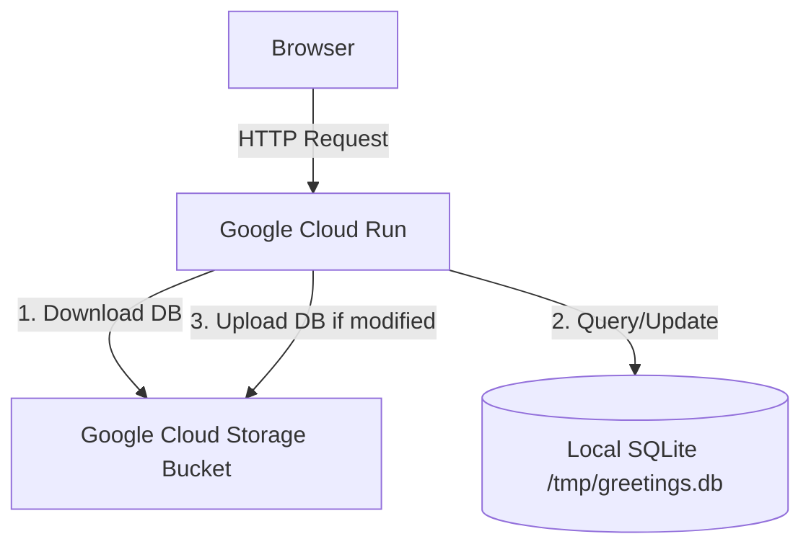

# Flask Hello World on Google Cloud

A Flask web application deployed on Google Cloud Run.

## Architecture



- **Runtime**: Python Flask on Google Cloud Run (containerized via `Dockerfile`).
- **Database**: SQLite database file (`greetings.db`) dynamically synced to/from a Google Cloud Storage bucket during runtime.
- **Continuous Deployment**: Automated builds via Google Cloud Build triggers linked to the GitHub repository.

---

## Deployment via Google Cloud Shell

Follow these instructions to set up the Google Cloud infrastructure and deploy the application.

### 1. Open Google Cloud Shell
Go to the [Google Cloud Console](https://console.cloud.google.com/) and click the **Activate Cloud Shell** icon at the top right of the dashboard.

### 2. Clone the Repository
Clone your GitHub repository in Cloud Shell:
```bash
git clone https://github.com/bluechristopher/flask-gcloud.git
cd flask-gcloud
```

### 3. Run the Deployment Script
Make the deployment script executable and run it:
```bash
chmod +x deploy.sh
./deploy.sh
```

The script will guide you through:
- Setting your active Google Cloud Project ID.
- Choosing a deployment region (defaulting to `asia-southeast1` for Singapore Time latency).
- Naming your GCS Bucket for storing the SQLite database (defaulting to `greetings-db-<PROJECT_ID>`).
- Enabling APIs, provisioning the GCS bucket, setting service account permissions, and executing the initial manual deploy.

Once complete, the script will output the URL of your live Web App.

---

## Running Locally

To run and test the application on your local machine:

### 1. Install Dependencies
```bash
pip install -r requirements.txt
```

### 2. Run the App
Without a GCS bucket environment variable configured, the app automatically falls back to a purely local SQLite database at `/tmp/greetings.db` for easy development.
```bash
python app.py
```
Open `http://127.0.0.1:8080` in your web browser.
